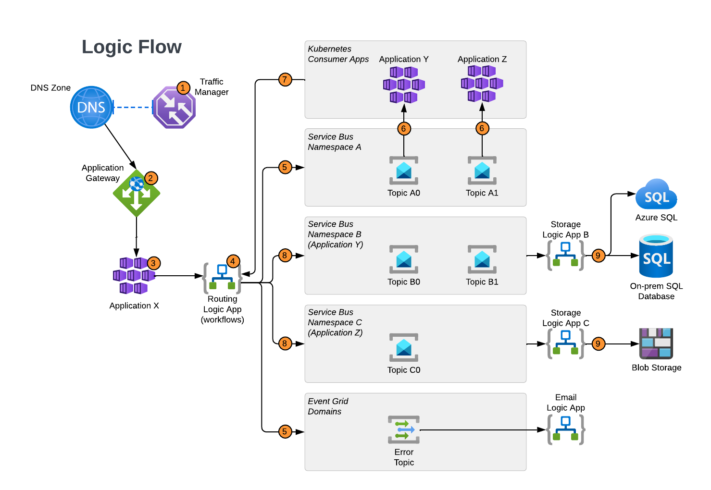

# Pub/Sub Azure Pattern

## Contents
1. [Pattern Function](#pattern-function)
2. [Pattern Resources](#pattern-resources)
3. [Pattern Requirements](#pattern-requirements)
4. [Pattern Structure](#pattern-structure)
5. [Pattern Logic Flow](#pattern-logic-flow)
6. [Service Usage Details](#service-usage-details)
7. [Workflow](#workflow)
   - [Data Ingestion](#data-ingestion)
   - [Data Queueing and Publishing](#data-queueing-and-publishing)
   - [Data Subscriptions](#data-subscriptions)
   - [Further Processing](#further-processing)
      -[Application Y](#application-y)
         - [Data Retrieval and Processing](#data-retrieval-and-processing)
         - [Data Storage on Azure SQL Server](#data-storage-on-azure-sql-server)
         - [Data Storage on On-Prem SQL Server](#data-storage-on-onprem-sql-server)
      - [Application Z](#application-z)
   - [Error Handling](#error-handling)
8. [Appendices](#appendices)
   - [Appendix A: Event Driven Architecture](#appendix-a-event-driven-architecture)
   - [Appendix B: Troubleshooting Guide](#appendix-b-troubleshooting-guide)
   - [Appendix C: Security Measures](#appendix-c-security-measures)
   - [Appendix D: Performance Considerations](#appendix-d-performance-considerations)
   - [Appendix E: Cost Analysis](#appendix-e-cost-analysis)
   - [Appendix F: Testing Strategies](#appendix-f-testing-strategies)

## Pattern Function
To process incoming event traffic. 
Route that traffic that event data based on defined logic workflows.
Make that event data available for other applications and services in a multi-region, reliable, scalable fashion.

## Pattern Resources
- Azure Traffic Manager
- Azure Kubernetes Service
- Azure Application Gateway
- Azure Logic Apps
- Azure Service Bus
- Azure Event Grid
- Azure Sql
- Azure Storage Account

## Pattern Requirements
- X number of applications either publishing data or subscribing to it.
- All infrastructure is deployed to two regions.
- All actions performed by applications must be proven to have completed or retried X number of times before an alert notification is triggered.

## Pattern Structure
*Please refer to the diagram below for the structural overview.*

## Pattern Logic Flow
1. Azure Traffic Manager routes to active Application Gateway.
2. Azure Application Gateway ingests data.
3. Application X processes data.
4. Routing Logic App routes data to Service Bus Namespace A Topics or to Event Grid Topics as appropriate.
5. Data is queued in Service Bus Topics.
6. Application Y or Z retrieves data from Service Bus Topics.
7. Applications Y and Z sends data to Routing Logic App.
8. Routing Logic App sends data to Service Bus Namespace B or C as appropriate.
9. Storage Logic App sends data to Azure SQL, On-Prem SQL, or Blob Storage as appropriate.

## Service Usage Details
This structure deploys infrastructure to two regions for redundancy.
- Each application are protected and routed to by an Azure Application Gateway.
- Client data will be routed to the Azure Application Gateway via Azure Traffic Manager for DNS routing redundancy.
- This structure hosts applications on AKS (Azure Kubernetes Service). 
- Azure Logic Apps are used to manage work by reviewing inputs to determine the proper workflow.
- Azure Service Bus will use Namespaces and Topics to organize data that can be retrieved from subscribers.
- Azure Event grid will be used to determine what actions are taken when the workflow has an error.
- Azure Sql and Azure Storage Accounts will be used to store data.

## Workflow
### Data Ingestion
Data traffic will be routed using traffic manager to the appropriate Azure Application Gateway. The Application Gateway will route the data to the appropriate backend path. Application X is designed to ingest the data in AKS and process the received data. After the data is processed, the application will POST a request trigger with a schema-appropriate body to the Azure Logic App callable endpoint designated by the application code and return a 201.

The callable endpoint will route the JSON load to a workflow to determine the next step. The workflow has two happy paths, 0 and 1, the Logic App will route successful messages to Azure Service Bus Namespace A, configured with Topics A0 and A1. Unsuccessful messages will be routed to the Azure Event Grid.

### Data Queueing and Publishing
Azure Service Bus will be configured with namespaces appropriate for business operations and topics appropriate for publishing distinct data. Assuming the successful paths from Application X to be 0 and 1, then the data from path 0 will be sent by the Logic App to Topic A0 and data from path 1 will be sent by the Logic App to Topic A1.

Azure Service Bus will be configured FIFO(First In First Out) message queuing in PeekLock mode. This requires the subscribing service to request the data, which will cause a consumption lock to be placed on the message, preventing other subscribers from retrieving the message. This consumption lock remains in place until the subscribing service releases it, or the TryTimeout is exceeded (default 60 secs).

A message that does not have the lock removed by the subscriber and exceeds the TryTimeout setting, will have its retry counter incremented by 1. If the retry counter exceeds the MaxRetries setting (default 10), the message will be routed to the DLQ (Dead Letter Queue), which is a built-in subqueue for all Azure Service Bus Queues and Topics with dead-lettering enabled. This pattern has dead-lettering enabled by default.

### Data Subscriptions
This pattern is defaulted with two subscribers, Application Y and Application Z. Each subscribing application will subscribe to their defined Azure Service Bus Topic and retrieve the published data. Upon completion of processing the data, the application will trigger the Service Bus Topic to remove the consumption lock.
In this pattern Application Y will use Topic A0 and Application Z will use Topic A1.

### Further Processing
#### Application Y
##### Data Retrieval and Processing
In this pattern, Application Y is designed to subscribe to Azure Service Bus Topic A0 and process the published data. The data will be loaded into an Azure SQL databases, both Azure hosted and On-Prem to be used by other applications and to provide data for reporting.

Once the data is recieved and processed, the application will POST a request trigger with a schema appropriate body to the Azure Logic App callable endpoint designated by the code. The callable endpoint will route the event data to the workflow, where it will be searched for key:value pairs in its payload to determine the next step of the workflow. Assuming the workflow has two successful paths, 0 and 1, the Logic App will route successful messages to an Azure Service Bus Namespace, Namespace B, configured with Topics B0 and B1. Unsuccessful messages, such as those with missing fields, will be routed to the Azure Event Grid.

As the last step of a successful workflow, the logic app will trigger the Azure Service Bus Topic A0 to resolve and delete the retrieved message. This ensures the data was properly ingested in the intake process and received by the next step. 

There are two possible happy paths from Application Y to be 0 and 1, the data from path 0, will be sent by the Logic App to Topic B0 and data from path 1 will be sent by the Logic App to Topic B1.

Namespace B will also be configured for FIFO queuing, PeekLock subscription handling, and dead-letter queuing. This is the same as Namespace A. This means that a message in Namespace B that does not have the lock removed by the subscriber and exceeds the TryTimeout setting, will have its retry counter incremented by 1. If the retry counter exceeds the MaxRetries setting (default 10), the message will be routed to the DLQ (Dead Letter Queue), which is a built in subqueue for all Azure Service Bus Queues and Topics with dead-lettering enabled. This pattern has dead-lettering enabled by default. 

##### Data Storage on Azure SQL Server
A Logic App workflow will be configured with a '"When messages are available in a topic subscription" Service Bus Trigger' for both Topics B0 and B1. This trigger will engage a Logic App workflow when data is placed in Topic B0, or a seperate workflow when data is placed in Topic B1. Topic B0 is designed for data to be stored in Azure SQL Server and Topic B1 is designed for data to be stored the On-Prem Sql Server. Application Y will be configured to send all successful messages to both Topics, B0 and B1, for redundancy. 

Data from Topic B0 will be sent to the Azure SQL Server via the Azure SQL Server standard connector and configured to retry delivery X times (default 4). If the Logic App does not recieve a successful response (200 message), the Logic App will default to its runafter configuration, which is configured in this pattern send the error to Azure Event Grid.

The last step of this logic app will be to remove the consumption lock from the message in Topic B0.  

##### Data Storage on On-Prem SQL Server
A Logic App workflow will be configured with a '"When messages are available in a topic subscription" Service Bus Trigger' for both Topics B0 and B1. This trigger will engage a Logic App workflow when data is placed in Topic B0, or a seperate workflow when data is placed in Topic B1. Topic B0 is designed for data to be stored in Azure SQL Server and Topic B1 is designed for data to be stored the On-Prem Sql Server. Application Y will be configured to send all successful messages to both Topics, B0 and B1, for redundancy. 
Data from Topic B1 will be sent to the On-Prem SQL Server via the SQL Server standard connector. This data will be sent via either ExpressRoute or VPN connection and the Logic App will be configured to retry delivery X times (default 4). If the Logic App does not recieve a successful response (200 message), the Logic App will default to its runafter configuration, which is configured in this pattern send the error to Azure Event Grid.
The last step of this logic app will be to remove the consumption lock from the message in Topic B1.  

#### Application Z
In this pattern, Application Z is designed to subscribe to Azure Service Bus Topic A1 and process the retrieved message. Then, the application will POST a request trigger with a schema appropriate body to the Azure Logic App callable endpoint designated by the code. The callable endpoint will route the event data to the workflow, where it will be searched for key:value pairs in its payload to determine the next step of the workflow. Assuming the workflow has 1 successful paths, path 0, the Logic App will route successful messages to an Azure Service Bus Namespace, Namespace C, configured with topic C0. Unsuccessful messages, such as those with missing fields, will be routed to the Azure Event Grid.

As the last step of a successful workflow, the logic app will trigger the Azure Service Bus Topic A0 to resolve and delete the retrieved message. This ensures the data was properly ingested in the intake process and received by the next step. 

Assuming only one successful path for Application Z, path 0, the data from path 0, will be sent by the Logic App to Topic C0.

Namespace C will also be configured for FIFO queuing, PeekLock subscription handling, and dead-letter queuing. This is the same as Namespaces A and B. This means that a message in Namespace C that does not have the lock removed by the subscriber and exceeds the TryTimeout setting, will have its retry counter incremented by 1. If the retry counter exceeds the MaxRetries setting (default 10), the message will be routed to the DLQ (Dead Letter Queue), which is a built in subqueue for all Azure Service Bus Queues and Topics with deal-lettering enabled. This pattern has dead-lettering enabled by default.

A Logic App workflow will be configured with a '"When messages are available in a topic subscription" Blob Storage Trigger' for both Topic C0. This trigger will engage a Logic App workflow when data is placed in Topic C0 which, in this pattern, is designed for data to be stored in Azure Blob Storage. A destination Azure Storage Account is configured with X containers. The Logic App will route to the appropriate container based on its configuration. This data transfer will be configured to retry delivery X times (default 4). If the Logic App does not recieve a successful response (200 message), the Logic App will default to its runafter configuration, which is configured in this pattern send the error to Azure Event Grid.

The last step of this logic app will be to remove the consumption lock from the message in Topic C0.  
### Error Handling
Any errors that occur during this process will be routed to Azure Event Grid. Event Grid will be configured with corresponding topics from the Azure Service Bus Namespace Topics; A0, A1, B0, B1, and C0. The Event Grid will also be configured with topics for each Azure Logic App workflow. When an error occurs in in either Service Bus or Logic App, the service with the error publishes a message to their corresponding topic. From there, the topic will then push a message to X Azure Service or Y webhook to be processed further. In this pattern, all Event Grid Topics will pushed to Azure an Azure Logic App configured with a workflow to send an email. 

## Appendices
### Appendix A: Event Driven Architecture
This pattern is aligned with event-driven architecture principles to allow for scalability and the ability to handle unpredictable loads. This is done by decoupling the individual components and allowing them to communicate through events, which means that each part can be scaled independently without affecting the others.

### Appendix B: Troubleshooting Guide
1. **Problem A:** Message Delivery Delays in Azure Service Bus:

   * **Symptoms:** Subscribers experience significant delays in receiving messages from Azure Service Bus.
   * **Possible Causes:** Network latency, service overload, misconfigured settings, or a bottleneck in the subscriber's processing.
   * **Solution:**
   
      1.1 Check the Azure Service Bus metrics for signs of increased latency or overload.
      
      1.2 Validate the configuration settings for the message's Time-to-Live (TTL), delivery attempts, etc.
      
      1.3 Examine the subscribers' processing efficiency and optimize if necessary.
      
      1.4 Consider scaling the Azure Service Bus or subscribers if the system is consistently reaching capacity.
      
      1.5 Consult Azure Monitor logs for specific error messages or warnings that may point to underlying issues.
2. **Problem B:** Unauthorized Access Errors in Azure Logic Apps:

   * **Symptoms:** Workflow failures or errors relating to unauthorized access when Azure Logic Apps attempt to interact with other resources.
   * **Possible Causes:** Incorrect permissions, expired or revoked credentials, misconfigured access policies.
   * **Solution:**
      
      2.1 Validate that the Azure Logic App has the appropriate permissions to access the required resources, such as using Managed Identity or specific roles.
      
      2.2 Ensure that the credentials used are valid and not expired, updating them if necessary in Azure Key Vault.
      
      2.3 Review and correct any misconfigured access policies or firewalls that may be blocking the Azure Logic App from interacting with the resources.
      
      2.4 Consult the detailed error messages in Azure Monitor to pinpoint the specific issue, such as a particular permission that is missing or a specific resource that cannot be accessed.
      
      2.5 If all else fails, engage Azure Support with detailed logs and error messages for specialized assistance.

### Appendix C: Security Measures
1. Authentication & Authorization:
   * Utilize Azure Active Directory for user authentication and authorization, ensuring that only authorized personnel have access to the resources.
   * Implement Role-Based Access Control (RBAC) to define access permissions for various roles within the applications.
2. Data Encryption:
   * Encrypt data at rest using Azure Storage Service Encryption.
   * Enable Transport Layer Security (TLS) to encrypt data in transit between services and applications.
3. Network Security:
   * Deploy Azure Application Gateway with Web Application Firewall (WAF) to detect and prevent malicious attacks.
   * Implement Virtual Network (VNet) peering and Network Security Groups (NSGs) to control traffic flow and isolate resources within a secure network boundary.
4. Monitoring & Logging:
   * Use Azure Security Center for unified security management, including continuous monitoring and advanced analytics.
   * Implement Azure Monitor and Log Analytics for real-time monitoring and logging of security events, providing insights into potential threats.
5. Identity Management:
   * Implement Managed Identities to automate and secure the management of credentials used by the services.
   * Utilize Azure Key Vault to store and manage sensitive information such as secrets, encryption keys, and certificates securely.
6. Compliance & Regulations:
   * Ensure compliance with industry regulations and standards, such as GDPR, HIPAA, etc., by adhering to Azure Compliance offerings.
   * Regularly conduct security audits and assessments to identify potential vulnerabilities and ensure alignment with compliance requirements.
7. Incident Response:
   * Develop and maintain a well-documented incident response plan in collaboration with Azure's security best practices.
   * Engage Azure's Rapid Response services for immediate assistance in case of critical security incidents.

### Appendix D: Performance Considerations
1. **Scalability**: Utilize Azure Kubernetes Service (AKS) and Azure Service Bus for horizontal scaling. Consider the potential for increased load and design the system to handle spikes efficiently.
2. **Latency**: Minimize latency by optimizing the message routing and processing within Azure Logic Apps and Service Bus. Monitor and identify bottlenecks to keep the data flow smooth.
3. **Reliability**: Implement redundancy in critical parts of the system, such as using Azure Availability Zones. Consider the potential failure points and how the system will handle them.
4. **Throughput**: Optimize the system for high throughput by using Azure Service Bus topics and subscriptions effectively. Monitor the message rates and adjust accordingly.
5. **Resource Optimization**: Keep an eye on resource utilization, such as CPU, memory, and storage. Optimize the code and configuration to use resources efficiently.
6. **Monitoring and Diagnostics**: Implement robust monitoring and diagnostic tools like Azure Monitor and Application Insights. Regularly review performance metrics and logs to identify and address issues.

### Appendix E: Cost Analysis
1. **Azure Kubernetes Service (AKS)**:
   - Cluster Costs: Based on the number of nodes, VM size, and reserved instances.
   - Additional Costs: For additional features like monitoring, logging, or premium networking.
2. **Azure Service Bus**:
   - Costs vary depending on the tier (Basic, Standard, Premium) and features like number of topics, subscriptions, messages, etc.
3. **Azure Logic Apps**:
   - Costs are based on the number of runs, execution frequency, and action execution.
4. **Azure SQL**:
   - Costs depend on the database size, number of transactions, and chosen pricing tier (e.g., DTU vs vCore).
5. **Azure Application Gateway**:
   - Pricing based on the number of hours the gateway is running and the amount of data processed.
6. **Azure Storage Account**:
   - Costs are associated with the amount of data stored, transactions performed, and any additional features like geo-replication.
7. **Other Considerations**:
   - Network Costs: Including bandwidth, VPN, and other networking components.
   - Compliance Costs: For any required compliance certifications or audits.
   - Support and Maintenance: Consider the cost of ongoing support, maintenance, and potential future upgrades.
8. **Cost Optimization Strategies**:
   - Leverage Azure Cost Management tools to monitor and optimize costs.
   - Consider reserved instances or spot pricing for applicable resources.
   - Regularly review resource utilization and remove or downgrade unnecessary resources.
   - Consider using Azure Hybrid Benefit or other cost-saving licensing options.

### Appendix F: Testing Strategies
1. **Unit Testing**:
   - Writing individual tests for smaller components of the application.
   - Utilizing popular testing frameworks like JUnit, NUnit, or xUnit, depending on the programming language.
   - Running tests automatically with GitHub Actions on every push or pull request to ensure code quality.

2. **Integration Testing**:
   - Testing the integration points between different services, such as Azure Service Bus, Logic Apps, and SQL.
   - Leveraging tools like Postman or SoapUI for API testing, combined with code-based integration tests.
   - Using GitHub Actions to run integration tests in parallel with unit tests or as a separate workflow step.

3. **Load Testing**:
   - Simulating real-world load on the system to understand how it behaves under stress.
   - Using tools like Apache JMeter or LoadRunner to generate traffic and analyze system performance.
   - Potentially automating load tests through GitHub Actions in staging or pre-production environments.

4. **Security Testing**:
   - Conducting regular vulnerability scanning and penetration testing to ensure the security of the system.
   - Utilizing tools like OWASP ZAP or specialized security testing platforms.
   - Integrating security tests into the CI/CD pipeline with GitHub Actions for continuous monitoring.

5. **User Acceptance Testing (UAT)**:
   - Collaborating with stakeholders to validate that the system meets business requirements.
   - Manual testing by end-users or automated end-to-end testing using tools like Selenium or Cypress.
   - Considering GitHub Actions for automated UAT if applicable.

6. **Accessibility Testing**:
   - Ensuring that the application is accessible to all users, including those with disabilities.
   - Using accessibility testing tools like Axe or Wave, and manual testing to comply with relevant standards like WCAG.
   - Integrating accessibility checks into GitHub Actions as part of the continuous testing process.

7. **Continuous Testing with GitHub Actions**:
   - Implementing a continuous testing strategy using GitHub Actions to run tests at various stages of the development process.
   - Configuring workflows to trigger on different GitHub events like push, pull requests, or scheduled runs.
   - Leveraging GitHub's matrix strategy to test across multiple environments, configurations, or versions.
   - Integrating test results and coverage reports with GitHub or third-party tools for visibility and traceability.

8. **Monitoring & Observability in Production**:
   - Continuous monitoring of the application in production using tools like Azure Monitor, Application Insights, or custom logging.
   - Implementing alerting and observability strategies to detect and respond to issues proactively.

9. **Test Data Management**:
   - Managing test data to ensure consistency, quality, and compliance.
   - Utilizing tools for test data generation, masking, or synthetic data creation to support various testing needs.

10. **Compliance & Regulatory Testing**:
    - Ensuring that the system meets specific industry standards and regulations.
    - Conducting regular audits and assessments, possibly with specialized testing or certification services.
